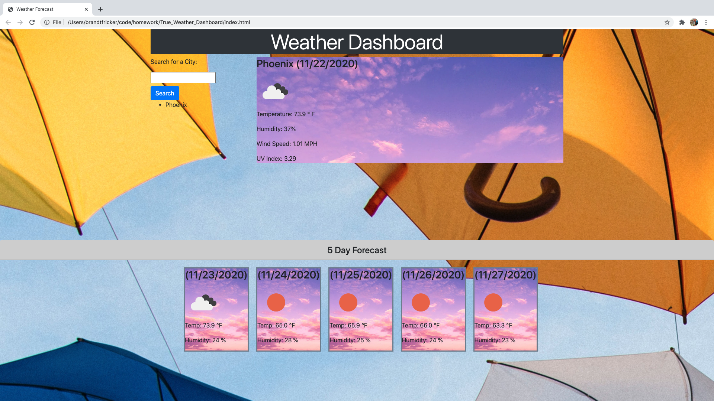

# True_Weather_Dashboard
https://brandt-fricker.github.io/True_Weather_Dashboard/

Introduction:
True Weather Dashboard is a great resource to help out when your traveling or just want to know how to take on the rest of your week.  Whether you need to grab your coat and bundle up or are good to go in a t-shirt, the True Weather Dashboard has the information you need!

User Story:
As human beings, we have to dress appropriately for the weather. In extreme cases, the wrong choices can lead to death.  I want something to give me the weather information I need for my day and week. 

Technological Outline:
The user inputs a city they are wanting to know the weather of and your presented with the current weather as well as a 5 day forecast of the city. The first step will be laying out what the screen and the user interface will look like. How the information is displayed on the screen. With the HTML constructed, the building of the infrastructure in which the data is gathered can be constructed.  Once the data gets collected about the city the user would like displayed, the output is made to appeal to the user. Lastly finishing touches and bug fixes are made.

Technologies Used: 
HTML,CSS,JavaScript,JQuery,OpenWeather API

Conclusion:
This weather dashboard will take the questions and wonder out of your day about the weather. Getting dressed is hard enough, let the True Weather Dashboard give you the edge to beat the elements and stay comfortable.  

;

Contact: https://brandt-fricker.github.io/my-responsiveness-portfolio/contact.html

Copyright (c) 2020 Brandt Fricker

Permission is hereby granted, free of charge, to any person obtaining a copy
of this software and associated documentation files (the "Software"), to deal
in the Software without restriction, including without limitation the rights
to use, copy, modify, merge, publish, distribute, sublicense, and/or sell
copies of the Software, and to permit persons to whom the Software is
furnished to do so, subject to the following conditions:

The above copyright notice and this permission notice shall be included in all
copies or substantial portions of the Software.

THE SOFTWARE IS PROVIDED "AS IS", WITHOUT WARRANTY OF ANY KIND, EXPRESS OR
IMPLIED, INCLUDING BUT NOT LIMITED TO THE WARRANTIES OF MERCHANTABILITY,
FITNESS FOR A PARTICULAR PURPOSE AND NONINFRINGEMENT. IN NO EVENT SHALL THE
AUTHORS OR COPYRIGHT HOLDERS BE LIABLE FOR ANY CLAIM, DAMAGES OR OTHER
LIABILITY, WHETHER IN AN ACTION OF CONTRACT, TORT OR OTHERWISE, ARISING FROM,
OUT OF OR IN CONNECTION WITH THE SOFTWARE OR THE USE OR OTHER DEALINGS IN THE
SOFTWARE.
